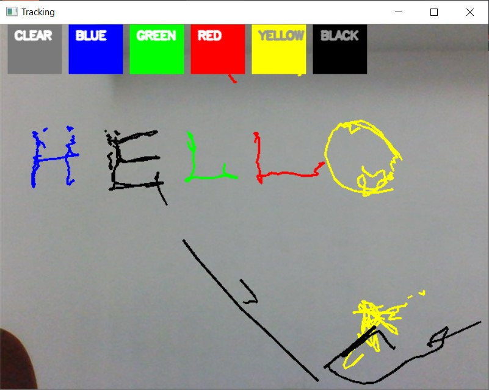
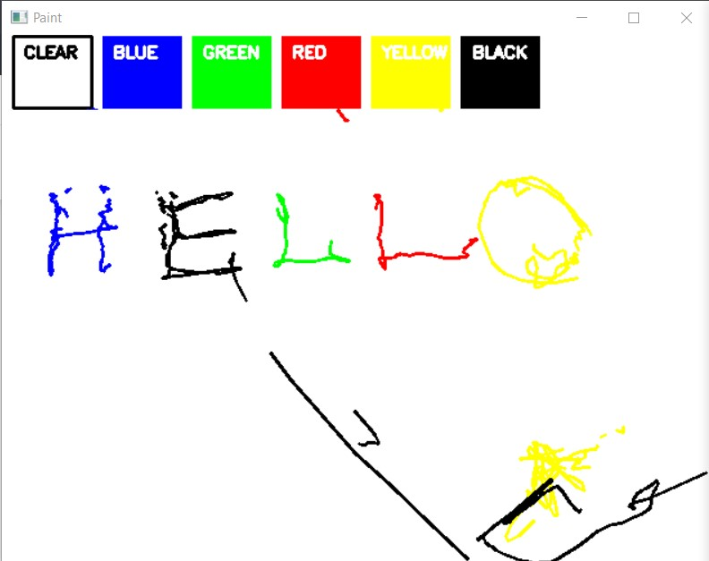

# Air_Canvas
A python program to create a virtual board to write.
We use OpenCV library to achive this.

## Output
This is the live screen where we can write:

 

This is the white screen where the lines drawn on the live screen can be viewed:

 

This virtual board is created using the front cam live image and the marker/pen is substituted by a coloured object.
This code contains 5 colours to choose and write from. Feel free to add more colours to your code and experiment.
